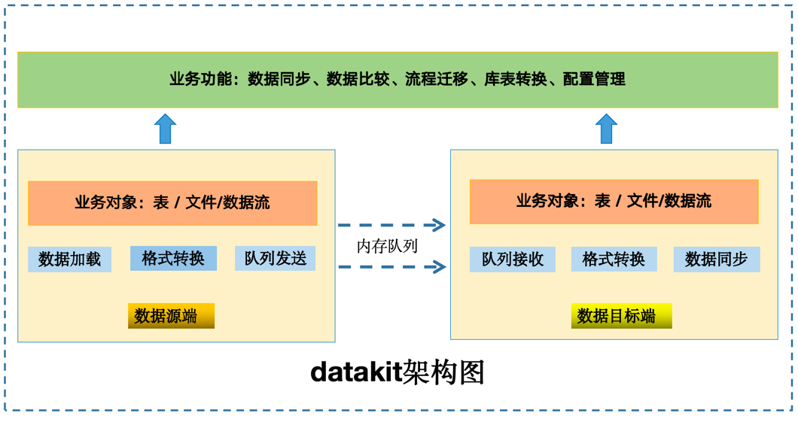
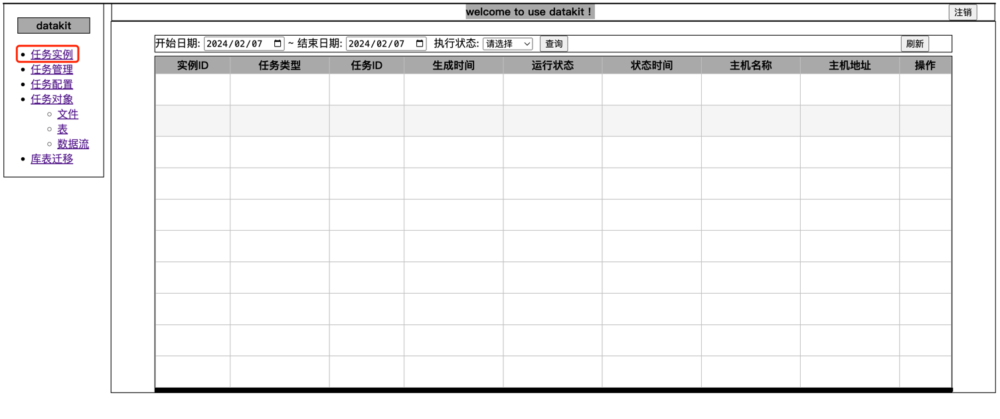
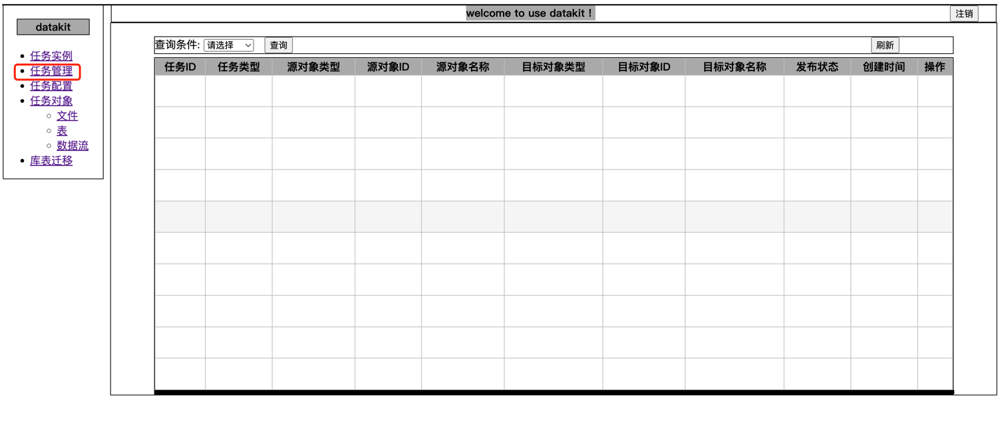
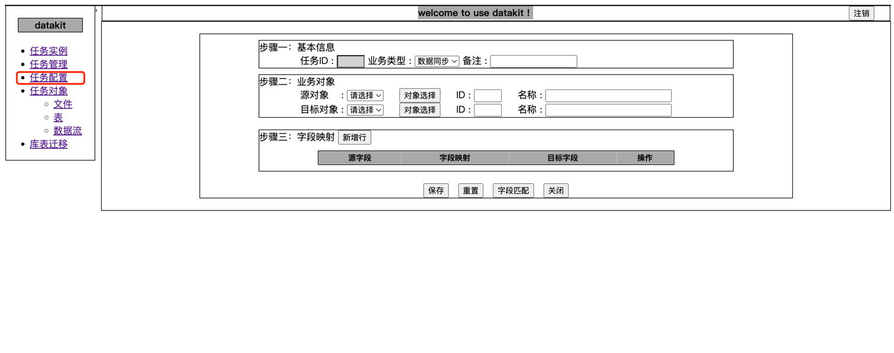
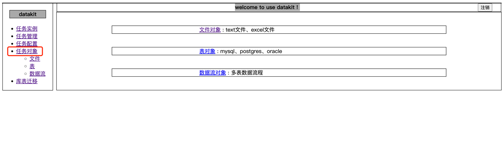
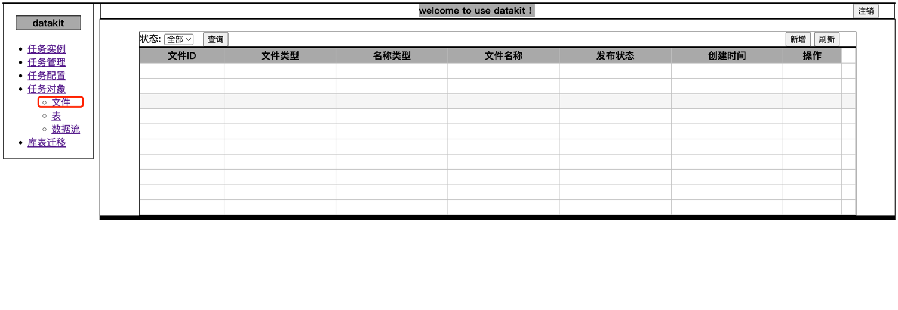
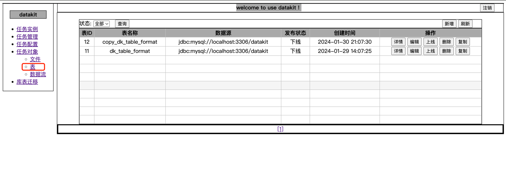
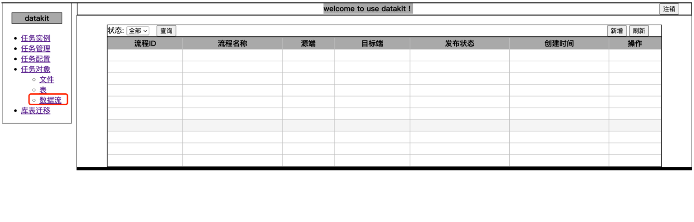

# datakit数据工具

## 1：功能简介

datakit是一款集四大核心功能：数据同步、数据比较、流程迁移、库表转换等数据使用工具，其核心设计目标：开发迅速、学习简单、轻量级、易扩展



- **数据同步**：从数据源端按照数据字段映射规则导入数据目标端。
- **数据比较**：数据源端和目标端差异比较，并支持针对差异以源端数据为准进行数据修复。
- **流程迁移**：实现源端数据库多表关联业务流程数据迁移另一种目标端数据库中。
- **库表转换**：不同类型数据库间表结构批量转换
- **配置管理**：业务对象(表、文件、数据流)配置、任务配置

注意: (1)数据源端和数据目标端可以是数据库表作为对象也可以是数据文件作为对象; (2)目前数据库支持oracle、mysql、postgres;
文件支持文本文件、excel文件; (3)支持二次开发集成新的数据库和文件

## 2：应用场景

### 2.1 数据同步场景

- 格式化txt文本数据指定字段导入数据库
- 格式化excel数据指定字段导入数据库
- 数据库表指定字段导出成文本文件
- 数据库表指定字段导出成excel文件
- 不同数据库间表数据互相同步倒换
- 不同文件格式数据互相同步倒换

### 2.2 数据比较场景

- 源端txt文件数据和目标端数据库表数据根据指定关键字段比较数据差异,并支持以源数据为准修复数据库表数据
- 源端excel文件数据和目标端数据库表数据根据指定关键字段比较数据差异,并支持以源数据为准修复数据库表数据
- 源端数据库表数据和目标端txt文件数据根据指定关键字段比较数据差异
- 源端数据库表数据和目标端excel文件数据根据指定关键字段比较数据差异
- 源端数据库表件数据和目标端数据库表数据根据指定关键字段比较数据差异,并支持以源数据为准修复数据库表数据
- 源端txt文件数据和目标端excel文件数据根据指定关键字段比较数据差异

### 2.3 流程迁移场景

- 可以将某一数据库中指定流程数据批量迁移到另外一个数据库，比如：(1)把生产库中指定流程数据迁移到测试环境进行流程验证; (2)
  按业务流程进行数据备份

### 2.4 库表转换场景

- 可以指定一个数据库用户下表结构迁移至另外一个数据库中，可以同一类型数据库之间转换，也可以支持不同数据库之间做表结构转换

## 3：模块结构

```
└── datakit
    ├── datakit-amdin                 // 基于maven-assembly-plugin插件的项目打包模块
        ├── common                    // datakit通用定义
        ├── dao                       // datakit元数据库操作
        ├── component                 // datakit任务核心逻辑
        ├── service                   // datakit业务处理    
        ├── controller                // datakit控制器
            ├── controllerRest        // rest控制器
            ├── controllerThymeleaf   // thymeleaf页面控制器
        ├── plugins                   // datakit业务对象(新增扩展业务对象)
    ├── datakit-dist                  // datakit项目打包
```

## 4：安装部署

- 环境要求:

  JDK:>=1.8 （建议用JDK 1.8）

  maven:>=3.5


- 配置介绍：

  application.properties datakit基本配置

  application-dynamic.properties 多数据源配置；  
  spring.datasource.druid[0]---配置datakit元数据库；
  大于>=1配置业务对象数据库


- 系统编译：  
  方式一：直接源代码编译
  方式二：直接运行编译脚本：linux下运行build.sh、windows下运行build.cmd

- 脚本执行：
  datakit-mysql-ddl.sql 元数据建表脚本和mysql生成序列函数
  datakit-mysql-ddl.sql 元数据序列名称插入脚本

- 应用启动：

  方式一：源代码启动：datakit-admin执行启动类DatakitApplication

  方式二：通过datakit-dist编译打包后jar包执行启动脚本：linux下运行startup.sh、windows下运行startup.cmd

## 5：操作演示

- 系统登录，用户名密码默认：admin/admin
  http://127.0.0.1:9193/datakit/index

注意：如果服务器部署时，需要将127.0.0.1替换为服务器的IP地址。

- datakit系统登录页面
  
- datakit任务实例页面
  
- datakit任务管理页面
  
- datakit任务配置页面
  
- datakit任务对象-总览页面
  
- datakit任务对象-文件页面
  
- datakit任务对象-表页面
  
- datakit任务对象-数据流页面
    
  
  
- <font size="6">datakit详细使用介绍见文档：https://docs.qq.com/doc/DTWVRSU5aeHd4T1RD </font>

## 6：版本现状

- 由于个人精力有限，目前完成主要功能，部分功能还有待增加和完整，如：权限管理、界面美化、定时任务等
- 还有数据库字段类型目前只是字符串、整型、时间类型，其他字段类型后续逐步完善

## 7：开发参与

- 为了能够持续完善datakit项目，datakit期望更多的代码开发爱好者参与代码贡献.
- github地址：
- gitee地址：11

## 8：沟通交流

如果您看到并体验了本工具，在使用时遇到了bug，可以在issue中进行反馈。加入QQ群:795166868，也可扫描下方二维码入群讨论：（加好友请注明："
datakit交流"）
  
